<div align="center">


</div>
<div align="center">



</div>

[](https://git.io/streak-stats)


```text
[RECV_DATA] >_ Initializing activity tracker...
>> [LOG_0x01]: Optimized Via360 Firebase listeners
>> [LOG_0x02]: Refactored SQL_Server connection strings
>> [LOG_0x03]: Pushed local changes to master --force
[SYS_STATUS]: STABLE // LISTENING_FOR_COMMITS